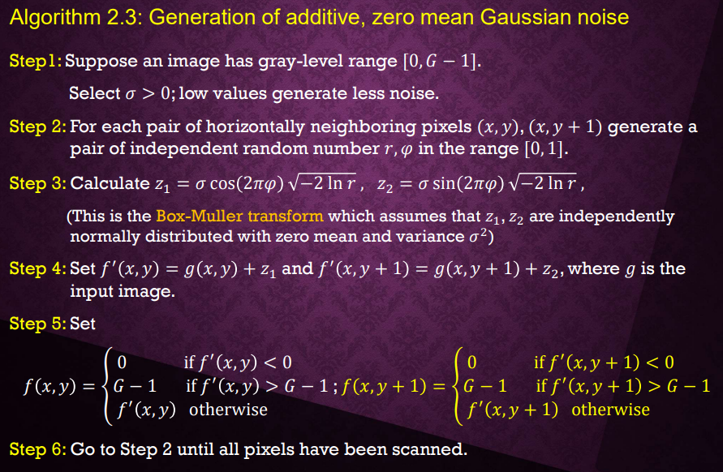

# 作業三 (寫白雜訊產生函數(高斯雜訊以及椒鹽雜訊))
**目標:**  
**1.請於作業一的程式中加入新增白雜訊產生函數之功能，並將程式執行檔名稱改為“HW3學號.exe”。  
2.主視窗請命名為 “AIP+學號”。  
3.輸入的影像可為灰階或彩色影像(以下之範例為灰階影像)，輸出則為雜訊影像、加入雜訊後之影像，以及上述三張影像之直方圖。直方圖的縱軸和橫軸之標示可省略。(注意雜訊影像之處理及呈現方式。)  
4.產生高斯白雜訊時程式需可由使用者輸入高斯雜訊分佈的變異數或標準差。高斯白雜訊產生函數請完全依照課本Algorithm 2.3之演算法實現，本函數之程式碼務必請自己撰寫。  
5.產生椒鹽雜訊時程式需可由使用者輸入椒鹽雜訊的百分比。  
6.程式語言限C、C++、C#、Python與JAVA系列(若用其他語言需事先告知並酌量扣分)，但作業繳交時必需編譯成EXE檔且在沒有COMPILER的情況下亦能執行。  
7.程式需可選擇要輸入的檔案名稱並自動利用附檔名判斷影像格式以及影像大小，界面設計需符合要求(輸入影像可自行決定是否呈現)。**    

**過程:**    
**在這份作業中，我將GUI視窗分成六部分  
分別為輸入影像、雜訊、高斯雜訊(椒鹽雜訊)及所對應之直方圖  
其中，高斯雜訊是根據課程講義演算法2.3自行撰寫(詳見程式碼第64行 def gaussian())
  
另外在高斯雜訊使用上，我製作一個標準差輸入框，user可以根據標準差的不同，  
輸出不同效果的高斯雜訊圖   
在椒鹽雜訊上面也是一樣，給予一個百分比輸入框。  
最後用PyInstaller將程式碼轉換成執行檔。**    

### GUI介面

### 高斯雜訊標準差輸入框 / 標準差=5之成果

### 椒鹽雜訊標準差輸入框 / 百分比=10%之成果